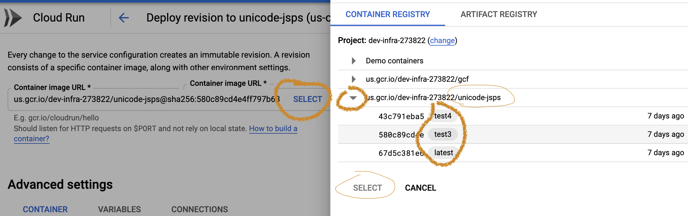

# Building UnicodeJsp

## Compiling
### Prerequisites
- Java
- Maven (download instructions [here](http://cldr.unicode.org/development/maven#TOC-Installing-Maven)
- GitHub account
- UnicodeJsp source downloaded

### Maven Environment setup

Setup your maven environment’s `.m2/settings.xml` as per
[CLDR instructions](http://cldr.unicode.org/development/maven#TOC-Getting-Started---GitHub-token). You don’t
need to actually need to download or build CLDR itself.

### Building from the command line

Run `mvn package` in the UnicodeJsps directory to build the JSPs.

### Building from Eclipse

UnicodeJsps can be imported into eclipse using the _Import->existing maven project_ menu option.
If you already have `UnicodeJsps` in eclipse, it might be better to remove it from eclipse before the import.

## Running

### Command Line

```shell
mvn jetty:run
```

You can now connect to <http://127.0.0.1:8080> as suggested from the command line.
Use Control-C to stop the server.

### Running from within Eclipse

This screenshot shows creating a `jetty:run` maven run configuration.


### Debugging from within eclipse

Jetty provides instructions [here](https://www.eclipse.org/jetty/documentation/jetty-9/index.html#debugging-with-eclipse) for debugging
within eclipse.  It is unknown whether this has been attempted with the UnicodeJsps.

## Upgrading the UnicodeJsps

### Run `org.unicode.tools.UpdateJspFiles`

This will copy a number of files from the unicodetools to the Jsp directory.
The items it doesn't cover are discussed below.

### Other

`{$workspace}/unicodetools/data/emoji/\<VERSION\>`

*   *\<emoji-variants\>* :construction: **TODO**

Other files:

*   alpha2_3.txt — mapping from 3 letter to 2 letter. No change needed.
*   fixCodes.txt — *dump of language/territory/region alias from CLDR. Fix to use
    ICU or CLDR directly instead.*

Files to investigate

*   annotations.txt - hieroglyphs
*   Categories.txt
*   Transforms?
    *   Deva-IPA.txt
    *   en-IPA.txt
*   Globe.txt
*   nameprep.txt
*   nfm.txt — *not sure what this is; investigate and use ICU instead.*
*   tables.txt
*   temp.html
*   test.htm

## Adding/Updating New Properties

Go to `XPropertyFactory.java` to add new properties other than the ones in /props/
### Using Beta Properties

Set CachedProps.IS_BETA to true.

Build & Test

1.  Run `mvn test`

:construction: **TODO**: These need a lot of work; they mostly print out a lot of gorp that you
need to scan over.

Run the server (see above)

Look at <http://localhost:8080/UnicodeJsps/properties.jsp>, and make sure that
there aren't any Z-Other props at the bottom (you'll need to update via Adding
New Properties if there are).

(:construction: **TODO**: explain how to do a Docker-based build here.)

## Commit/PR

1.  Commit the code to your own branch, create a PR on GitHub
2.  Verify that all of the checks (build steps) succeeded, for example
    <https://github.com/unicode-org/unicodetools/pull/22/checks> in particular
    "build JSP.". Request reviews
3.  Merge PR into master when reviewed.

## Make a release / Deploy

When it is time to push a new version of the JSPs and tools, it is time to make
a "release". A release is a snapshot of the entire repository, including all
Unicode Tools.

1.  Go to the UnicodeTools repository release page at
    <https://github.com/unicode-org/unicodetools/releases>
2.  *Draft a New Release*Click the button,
    1.  Set the "Tag version" field to a release tag with the current date, such
        as "**release-2020-09-15**"
    2.  The *Target* is what the tag refers to. Leave this at **master** to tag
        the current master.
    3.  Enter a descriptive title (such as "2020-09-15 Release"
    4.  Optionally fill in some content (see image at right). PRs and issues
        will autocomplete if you want to mention a specific PR or issue.\
        
    5.  click Publish Release (Green button at the bottom)
3.  Now, go to the (A) [ Actions tab in GitHub, and click on the (B) "Push to
    GCR Github Action"
    workflow](https://github.com/unicode-org/unicodetools/actions?query=workflow%3A%22Push+to+GCR+Github+Action%22).
    (see illustration)

    

    1.  Every tagged release creates a new run of this workflow. Look for your
        new tag to show up and wait for it to finish building (should only take
        a few minutes) and show a green checkmark. ( Example at (C) : "test3"
        and "test4" )
4.  Now, login to https://console.cloud.google.com/ with your unicode.org
    account
    1.  At the top of the page, switch the project to Unicode Dev Infra\
        
    2.  From the left nav / hamburger menu, find "Cloud Run".
        Click on the link for the service "**unicode-jsps-staging**". This way
        you can update the staging release before going to production.
    3.  Now, choose "Edit and Deploy a New Revision"
    4.  You will get a page that prompts you to choose a docker image to be
        deployed. See the illustration below.

        

        2.  Click Select
        3.  expand the "us.gcr.io/dev-infra…/unicode-jsps" images
        4.  You should see the release tags (test3, test4) show up as "images".
        5.  Choose the image that corresponds with your deployment (such as
            **2020-09-15-release**) - the full title may not show up.
        6.  Click Select below the image.
    5.  Make sure "**√ Serve this revision immediately**" at the bottom is
        checked.
    6.  Finally, click the Deploy button (way at the bottom) to schedule the
        deployment
    7.  Allow 15 seconds or so to update (you will be given visual progress as
        the new revision takes over traffic.
5.  Check
    1.  Test the new deployment at
        <https://unicode-jsps-staging-5ocgitonaa-uw.a.run.app>
    2.  To check new characters (for example):
        <https://unicode-jsps-staging-5ocgitonaa-uw.a.run.app/UnicodeJsps/list-unicodeset.jsp?a=\p{age=8.0}-\p{age=7.0}>
    3.  Check at the bottom for the right Unicode and ICU versions.
    4.  Click once on each top link to do simple sanity check.
    5.  Once that's successful then:
6.  **Deploy to Production**
    1.  Repeat step §4.2 above, but choose the service **unicode-jsps** instead
        of **unicode-jsps-staging**.
7.  Check
    1.  Go to <http://unicode.org/cldr/utility/> to check that that works, using
        the same steps as #3, that is:
    2.  To check new characters (for example):
        <http://unicode.org/cldr/utility/list-unicodeset.jsp?a=\p{age=8.0}-\p{age=7.0}>
    3.  Check at the bottom for the right Unicode and ICU versions.
    4.  Click once on each top link to do simple sanity check.
8.  Revert?
    1.  You can choose a back-level image tag (Step 4.4 above) in order to
        revert to previous versions.
